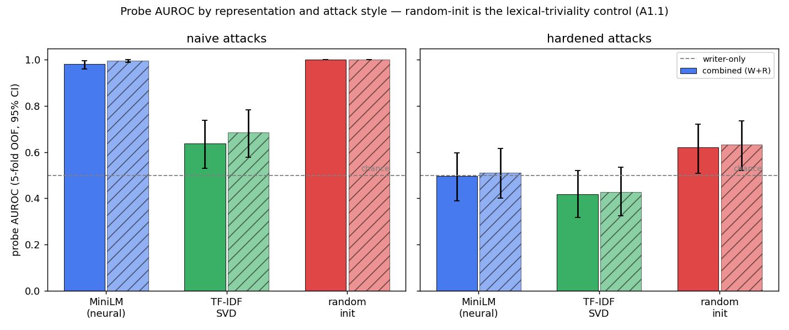
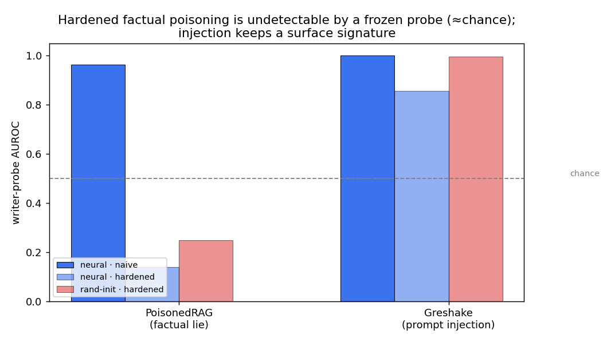
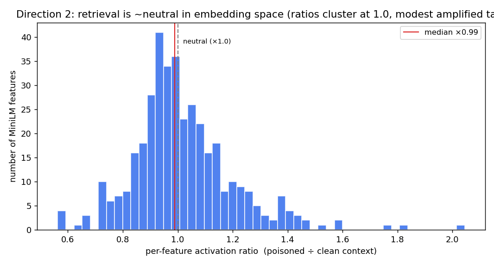
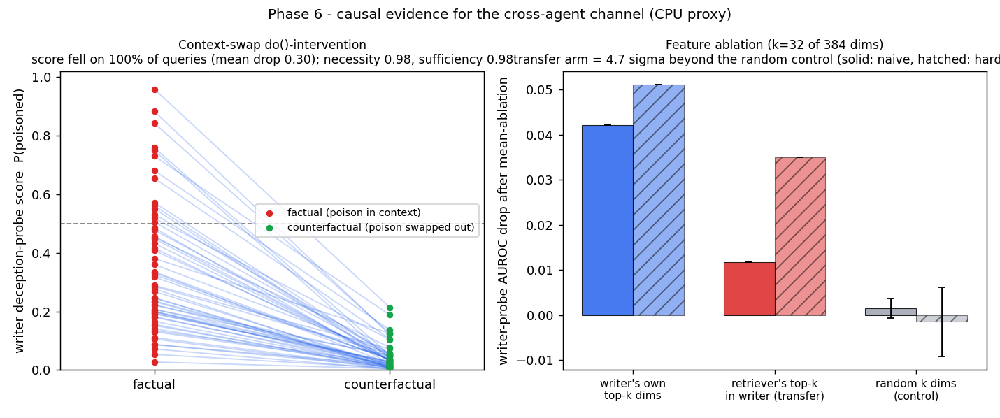

# SAE Deception Detection in Multi-Agent RAG Pipelines

**Probing for deception in multi-agent retrieval-augmented generation (RAG) pipelines using sparse autoencoders, linear probes, and causal interventions.**

[](./LICENSE)
[](https://www.python.org/)
[](#project-status)

---

## Animated Explainer

A self-contained, 3Blue1Brown-style animated walkthrough of the entire project (the problem, the pipeline, the attacks, the probe, the controls, and the causal test) lives at [`docs/project_explainer.html`](docs/project_explainer.html). Download and open it in any browser - it is a single HTML file with no dependencies, with play/pause, scene navigation, and scrubbing.

## Overview

Multi-agent LLM systems currently lack reliable mechanisms for detecting manipulation that propagates between agents through a shared context window, whether introduced deliberately or via indirect prompt injection in retrieved documents. This project adapts three single-model interpretability techniques - sparse autoencoders (SAEs), linear probes, and attribution-style causal analysis - and instruments them across a LangGraph retriever-writer pipeline, in order to test whether deceptive or adversarial activation patterns are detectable *between* agents rather than only *within* a single model.

The work is anchored on Sharkey et al. (2025), *Open Problems in Mechanistic Interpretability* ([arXiv:2501.16496](https://arxiv.org/abs/2501.16496)), which identifies multi-agent and multi-model settings as an open problem for the field.

## Motivation

Agentic LLM deployments are scaling faster than the interpretability tooling intended to oversee them. Concurrent attack research has demonstrated that retrieval-augmented agents are vulnerable to:

- **Indirect prompt injection** - Greshake et al., 2023 ([arXiv:2302.12173](https://arxiv.org/abs/2302.12173))
- **Knowledge-base poisoning** - Zou et al., 2024, PoisonedRAG ([arXiv:2402.07867](https://arxiv.org/abs/2402.07867))
- **Memory backdoors** - Chen et al., 2024, AgentPoison ([arXiv:2407.12784](https://arxiv.org/abs/2407.12784))

with reported attack-success rates above 80% at poison rates below 0.1%. This project contributes a bridge between three active research agendas: sparse coding, lie and deception detectors, and tools for aligning multiple AI systems.

## Research Directions

### Direction 1 - Cross-agent activation transfer as a deception signal

**Hypothesis.** If an adversarial feature activates in Agent A and a structurally similar feature appears in Agent B's subsequent forward pass, that transfer pattern across the context boundary may be a more reliable deception signal than any single-agent probe.

**Method.** Train linear probes on features from both the retriever and the writer; compare writer-only, retriever-only, and combined probes; identify features discriminative for both agents; test the transfer mechanism with causal ablations.

**Pre-registered falsifier.** Combined-probe AUROC indistinguishable from writer-only AUROC.

### Direction 2 - Does retrieval amplify or suppress adversarial features?

**Hypothesis.** Retrieval acts either as an amplifier (adversarial content in retrieved documents activates downstream features the model would not otherwise produce) or as a filter (retrieved content drowns out adversarial structure).

**Method.** Measure per-feature activations in the writer under three conditions: no context, clean retrieved context, and poisoned retrieved context; compute per-feature amplification ratios.

**Pre-registered falsifier.** Amplification ratios concentrated near 1.0 (retrieval is neutral).

### Direction 3 - Generalisation of probes across model families

**Hypothesis.** If probes generalise across model families, deceptive representations are likely a general property of the multi-agent setting; if not, deception detection is architecture-specific, with significant implications for cross-model safety monitoring.

**Method.** Train SAE probes on Gemma 2-2B with Gemma Scope; evaluate on Llama 3.2-3B and Mistral-7B with community SAEs under identical pipelines and attack sets.

**Pre-registered falsifier.** Cross-architecture transfer AUROC at chance.

## System Architecture

The pipeline is a two-agent LangGraph `StateGraph`:

```
START -> Retriever (dense top-k retrieval) -> Writer (answer generation) -> END
```

The retriever-to-writer edge is the cross-agent context boundary on which all instrumentation operates. The representation backend is fully swappable (`src/sae_deception/interp/represent.py`):

| Backend | Description | Role |
|---|---|---|
| `neural` | MiniLM sentence embeddings (CPU) | De-risk proxy for model activations |
| `tfidf_svd` | TF-IDF with truncated SVD | Representation-agnostic cross-check |
| `random_init` | Untrained random feature map | Lexical-triviality control |
| `gemma_sae` | Gemma 2-2B residual stream + Gemma Scope SAE (GPU) | Research target |

Replacing `representation: neural` with `representation: gemma_sae` in `configs/default.yaml` re-runs the identical analysis on real SAE features; no other code changes are required.

## Key Results (CPU De-Risk Phase)

All numbers below were produced on the CPU proxy representation (MiniLM standing in for Gemma 2-2B + Gemma Scope SAE features) and bound the method, not the phenomenon. Every result reproduces bit-for-bit from a single command. Full detail: [`experiments/260605_phase5_probe_derisk/results.md`](experiments/260605_phase5_probe_derisk/results.md).

### Headline statistics

| Metric | Value | Interpretation |
|---|---|---|
| Poison retrieval rate (top-4) | **1.00** | Phase 4 gate (>= 0.30): **PASS** |
| Attack success (worst-case reader) | 1.00 | Upper bound; generative writer pending GPU |
| Writer-probe AUROC, naive attacks (MiniLM) | 0.981 [0.96, 1.00] | High, but see the control below |
| Writer-probe AUROC, naive attacks (random-init control) | **1.000** | Naive labels are lexically trivial |
| Writer-probe AUROC, hardened attacks (MiniLM) | **0.497** [0.39, 0.60] | Chance: frozen probes miss factual poisoning |
| Hardened AUROC by attack family (MiniLM) | PoisonedRAG 0.138 / Greshake 0.855 | Injection detectable; factual lies are not |
| Combined minus writer-only AUROC (all settings) | +0.00 to +0.05 | Correlational transfer signal: null |
| Context-swap necessity / sufficiency | **0.98 / 0.98** | Poisoned document causally drives the behaviour |
| Probe-score drop under context swap | mean -0.30; fell on **100%** of queries | Probe tracks the cross-agent channel |
| Transfer feature-ablation effect | **~4.7 sigma** beyond random control | Agents share discriminative feature axes |
| Writer-retriever top-32 dimension overlap | 13-14 observed vs 2.67 by chance | Shared-axis precondition for Direction 1 |
| Median retrieval amplification ratio | 0.99 | Retrieval is approximately neutral (Direction 2) |

### Figure 1 - Probe performance and the lexical-triviality control

Linear-probe AUROC (5-fold out-of-fold, 95% bootstrap CI) per representation and attack style. On naive attacks the untrained random-init control reaches AUROC 1.0, proving the label is decodable from surface text; on hardened attacks all representations fall to approximately chance.



### Figure 2 - Injection detection and factual-lie detection are different problems

Hardened factual poisoning (PoisonedRAG, a single-token lie) is undetectable by a frozen-feature probe (0.138, below chance), while hardened indirect prompt injection (Greshake) retains a strong signature (0.855) because injected instructions are intrinsically foreign text.



### Figure 3 - Retrieval is approximately neutral in representation space

Per-feature activation ratios (poisoned versus clean context) cluster at 1.0 with a modest amplified tail (13.3% of features above 1.2x), consistent with the pre-registered Direction 2 neutrality falsifier on this proxy.



### Figure 4 - Causal evidence for the cross-agent channel (Phase 6)

Left: swapping the poisoned document for its clean counterpart (a do()-intervention on the retriever-writer channel) collapses the writer's deception-probe score on every query (necessity 0.98, sufficiency 0.98). Right: mean-ablating, in the writer, the feature dimensions identified by the retriever probe costs approximately 4.7 standard deviations more AUROC than ablating random dimensions - evidence the two agents read the deception signal off shared feature axes.



### Findings in brief

1. **Attack-presence labels are lexically confounded.** A representation with no trained parameters achieves AUROC 1.000 on boilerplate-style attacks (Figure 1). Every headline metric must therefore be reported alongside a random-initialisation control.
2. **Frozen-feature probes do not detect hardened factual poisoning.** Probe AUROC falls to chance on single-token lies, while indirect prompt injection remains detectable (Figure 2). These are distinct detection problems and are reported separately.
3. **Correlational cross-agent signal is confounded.** Combined writer-plus-retriever probes never significantly outperform writer-only probes, because both agents observe the same poisoned text. The cross-agent claim therefore rests on causal evidence.
4. **Causal evidence supports the channel hypothesis (proxy).** Both the context-swap intervention and the cross-agent feature-ablation arm produce large, control-referenced effects (Figure 4).
5. **Retrieval is approximately neutral in representation space** (Figure 3), consistent with the Direction 2 falsifier on this proxy.

## Repository Structure

```
sae-deception-multiagent-rag/
├── app/
│   └── streamlit_app.py        Interactive dashboard (make ui)
├── configs/
│   └── default.yaml            Experiment configuration
├── src/sae_deception/
│   ├── pipeline/               LangGraph nodes, graph state, RAG pipeline
│   ├── probes/                 Linear probe training and evaluation
│   ├── attacks/                PoisonedRAG and Greshake attack corpora
│   └── interp/                 Representation backends, causal ablation
├── scripts/
│   ├── run_experiment.py       Phases 1/4/5 experiment (single command)
│   ├── run_phase6.py           Phase 6 causal harness
│   └── plot_results.py         Figure generation
├── experiments/                One folder per experiment (results, manifests)
├── tests/                      Model-free unit tests (corpus, probes, graph, ablation)
├── data/                       Git-ignored: activations, corpora, caches
└── docs/                       Assumptions audit, pre-mortem, notes
```

## Installation

Requires Python 3.11+. A GPU with at least 16 GB VRAM is required only for the Gemma 2-2B + Gemma Scope arm; the full de-risk track runs on CPU.

```bash
git clone --recurse-submodules https://github.com/Vidura-Wijekoon/sae-deception-multiagent-rag-pro.git
cd sae-deception-multiagent-rag-pro

conda create -n sae-deception python=3.11 -y
conda activate sae-deception
make dev    # submodule init + editable installs + pre-commit hooks
```

## Usage

```bash
make experiment   # Phases 1/4/5 - corpus, pipeline, probes, controls (CPU)
make phase6       # Phase 6 - causal context-swap and feature ablation (CPU)
make ui           # Streamlit dashboard with live pipeline playground
make test         # unit test suite
make smoke        # GPU smoke test (loads Gemma 2-2B, single forward pass)
```

The dashboard provides five views: a phase-gate overview, Direction 1 probe results with bootstrap confidence intervals, Direction 2 and Phase 6 causal results, an attack-corpus browser with clean-versus-poisoned comparisons, and a live playground that runs queries through the LangGraph pipeline with a real-time deception-probe readout.

## Reproducibility

- Every run writes a `run_manifest.json` recording the git commit, configuration hash, representation backend and revision, seeds, and host information.
- Attack corpora are versioned with per-example SHA-256 hashes (`data/attacks/*_manifest.jsonl`).
- Random seeds are fixed for all stochastic components; CPU runs reproduce bit-for-bit.
- Each result is reproducible from a single command (`python scripts/run_experiment.py --config configs/default.yaml`).

## Project Status

| Phase | Gate | Status |
|---|---|---|
| 0 | Environment and core literature | Complete |
| 1 | LangGraph retriever-writer pipeline | Complete |
| 2 | Per-agent activation capture | Complete (CPU proxy); GPU capture pending |
| 3 | Gemma Scope SAE attachment and feature labelling | Pending (GPU) |
| 4 | 120-example attack corpus with measured success rate | Complete (gate passed) |
| 5 | Per-representation probe AUROC with controls | Complete (CPU proxy) |
| 6 | Cross-agent transfer: correlational and causal | Complete (CPU proxy) |
| 7 | Summary, external feedback, extended-mode decision | Summary complete; feedback pending |

This is a research preview produced during a de-risk phase. Results may be null, partial, or revised, and the codebase is not intended for production use.

## Citation

```bibtex
@misc{wijekoon2026saedeception,
  author       = {Wijekoon, Vidura},
  title        = {SAE Deception Detection in Multi-Agent RAG Pipelines},
  year         = {2026},
  howpublished = {\url{https://github.com/Vidura-Wijekoon/sae-deception-multiagent-rag-pro}},
  note         = {BlueDot Impact Technical AI Safety Project. Research preview.},
}
```

## Acknowledgements

- **BlueDot Impact**, Technical AI Safety Project, for scoping and supporting this work.
- **Lee Sharkey and co-authors** of *Open Problems in Mechanistic Interpretability*, whose Section 7 frames the problem addressed here.
- **The Gemma Scope team** for releasing the SAE suite that makes this project tractable.
- **The Anthropic Circuit Tracing team** for the attribution-graph methodology this project extends to the multi-agent setting.
- **The EleutherAI / delphi maintainers** for the open auto-interpretation pipeline.

## License

MIT - see [LICENSE](./LICENSE).

## Contact

Vidura Wijekoon - businessaividura@viduraaitech.space

Technical questions and bug reports: [GitHub Issues](https://github.com/Vidura-Wijekoon/sae-deception-multiagent-rag-pro/issues)
